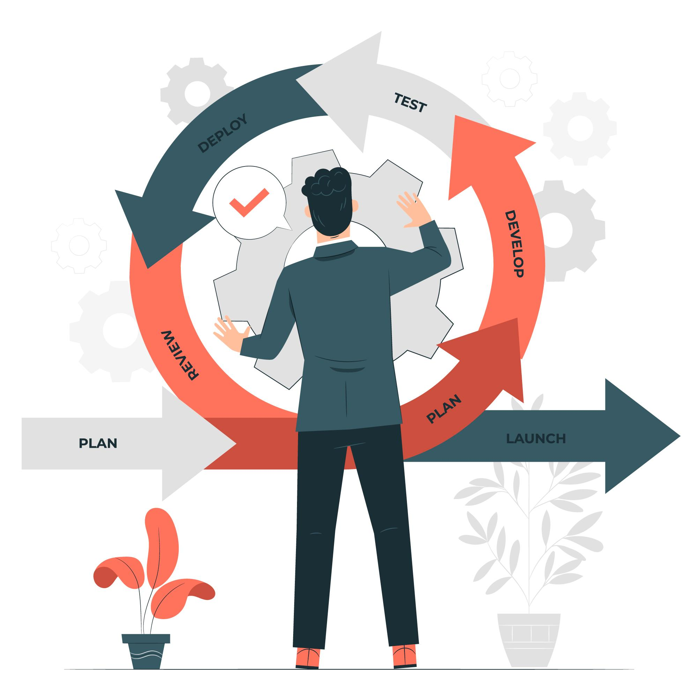
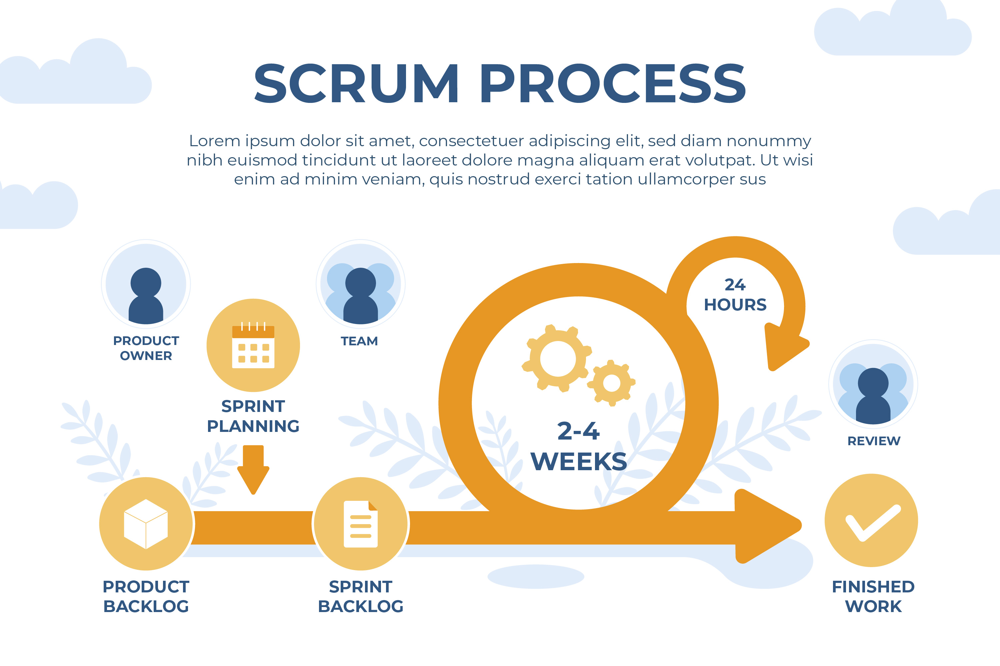

# Agile Principles and Methodology

## Introduction

**Agile** is a mindset that emphasizes flexibility, collaboration, and customer satisfaction. You can also say that Agile is a set of Values and Principles. This README will guide you through the core principles and methodologies of Agile, with a special focus on SCRUM.

## Agile Principles

Agile is built on 12 principles that guide teams towards effective project management:

| Principle                    | Description                                                                          |
| ---------------------------- | ------------------------------------------------------------------------------------ |
| 1. Customer Satisfaction     | Deliver valuable software early and continuously.                                    |
| 2. Welcome Change            | Embrace changing requirements, even late in development.                             |
| 3. Deliver Frequently        | Deliver working software frequently, with a preference for shorter timescales.       |
| 4. Collaboration             | Business and developers must work together daily.                                    |
| 5. Motivated Individuals     | Build projects around motivated individuals.                                         |
| 6. Face-to-Face Conversation | The most efficient method of conveying information is to do it face-to-face.         |
| 7. Working Software          | Working software is the primary measure of progress.                                 |
| 8. Sustainable Development   | Maintain a constant pace indefinitely.                                               |
| 9. Technical Excellence      | Continuous attention to technical excellence enhances agility.                       |
| 10. Simplicity               | The art of maximizing the amount of work not done is essential.                      |
| 11. Self-Organizing Teams    | The best architectures, requirements, and designs emerge from self-organizing teams. |
| 12. Reflect and Adjust       | At regular intervals, the team reflects on how to become more effective.             |

---

---

## Agile Methodology

Agile encompasses various methodologies, including SCRUM, Kanban, and XP. This section focuses on SCRUM:

- **SCRUM**: A framework for managing and completing complex projects.
- **Official Documentation**: [SCRUM Guide](https://scrumguides.org/scrum-guide.html)
- **Cheat Sheet**: [SCRUM Cheat Sheet](scrum-cheat-sheet.pdf)

## Technical Terms in SCRUM

Here are some key terms used in SCRUM methodology:

| Term                 | Description                                                                        |
| -------------------- | ---------------------------------------------------------------------------------- |
| Sprint               | A time-boxed period for developing a specific set of features.                     |
| Sprint Planning      | A meeting to define what will be delivered in the upcoming Sprint.                 |
| Sprint Retrospective | A meeting to reflect on the past Sprint and identify improvements.                 |
| Product Backlog      | An ordered list of everything that is known to be needed in the product.           |
| Daily Standup        | A short meeting to synchronize activities and create a plan for the next 24 hours. |

---

---

## Conclusion

Explore Agile methodologies further and enhance your project management skills! For more resources, check out:

- [Agile Alliance](https://www.agilealliance.org/)
- [Scrum.org](https://www.scrum.org/)

Happy Agile journey!
